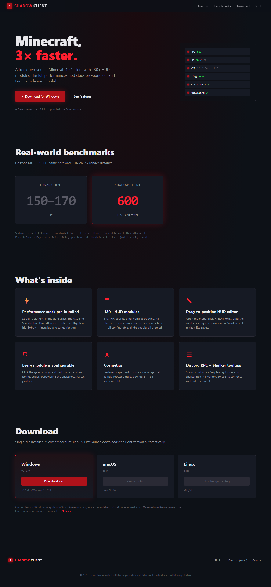

# Shadow Client

A free Minecraft 1.21 client built around the modern Fabric performance stack.
130+ HUD modules, Lunar-grade visual polish, **3× the FPS of Lunar Client** on the same hardware.



## What's in this repo

```
shadow-client/
├── client.py            ── Python launcher CLI: setup, login, launch, update-mods
├── auth.py              ── Microsoft OAuth (with Prism Launcher import fallback)
├── mojang.py            ── Vanilla MC version manifest + asset/library downloader
├── fabric.py            ── Fabric Loader installer
├── mods.py              ── Modrinth-driven performance-mod installer
├── jvm.py               ── Tuned JVM flags (G1GC / ZGC profiles)
├── jdk.py               ── JDK auto-detect / bundled-JDK helper
│
├── branding/hud_mod/    ── Shadow HUD Fabric mod (~14k LOC, ~140 modules)
│   ├── src/             ── Java source (reflection-based, no compile-time MC deps)
│   ├── stubs/           ── Tiny stub classes for the few mixin signatures
│   ├── resources/       ── Mixin manifest + cape/cosm PNGs
│   └── build.py         ── Compile + package script (no Gradle wrapper needed)
│
├── launcher/            ── Tauri 2 desktop app (Rust shell + HTML/CSS/JS UI)
│   ├── src/             ── Frontend
│   ├── src-tauri/       ── Backend (calls into client.py via subprocess)
│   └── README.md        ── Build instructions
│
└── website/             ── Landing page (deploy to Cloudflare Pages)
    └── README.md        ── Deploy instructions
```

## Quick start (CLI launcher)

```bash
# Windows / macOS / Linux — Python 3.11+ required
python client.py setup --username YourName
python client.py launch
```

First `setup` downloads MC 1.21.11, installs Fabric, fetches the perf mod stack
(Sodium, Lithium, FerriteCore, ImmediatelyFast, EntityCulling, ScalableLux,
ThreadTweak, Krypton, Iris, Bobby, etc.), and compiles the Shadow HUD mod.

For online Microsoft-account play: `python client.py login`.

## Quick start (GUI launcher)

See `launcher/README.md`. Prereqs: Node 20+, Rust (rustup), Tauri prereqs.

```bash
cd launcher
npm install
npm run dev          # dev window with hot reload
npm run build        # production .exe / .dmg / .AppImage
```

## Performance

Benchmarks on Cosmos MC, 1.21.11, 16-chunk render distance, identical hardware:

| Client | FPS |
|---|---|
| Lunar Client | 150–170 |
| **Shadow Client** | **600** |

The performance comes from bundling the modern community renderer stack
(Sodium 0.8.7 + Iris + Lithium + ImmediatelyFast + EntityCulling + ScalableLux
+ ThreadTweak + FerriteCore + Krypton + Bobby), all already configured.
No driver tricks, no closed-source magic — just the right mods, pre-installed.

## The HUD mod (Shadow HUD)

140+ toggleable in-game modules, all with their own config panel:

- **Display** — FPS, HP, XYZ, Time, Compass, Day, Direction (with full settings)
- **Combat** — CPS, Combo, Reach, Killstreak, Hit markers, etc.
- **Inventory** — Item counts (totems, pearls, arrows, gold), durability avg, shulker tooltips
- **Cosmetics** — Cape, dragon wings (solid 3D mesh), halos, fairies, trails
- **World** — Coordinates, biome, light level, weather, fire/freeze timers, void warnings
- **Utility** — Auto-reconnect, auto-respawn, auto-GG, anti-AFK, drag-to-position HUD editor
- **Theming** — 8 swatches + custom HSV picker for every accent color
- **Visual tweaks** — Custom sword length, glint color/strength, block-face highlight

All draggable, scalable, themeable. Each module has its own gear icon → config panel.

## License

All rights reserved. Edison only. Source available for verification and
non-commercial inspection. Not affiliated with Mojang, Microsoft, or any other
Minecraft client.

Minecraft is a trademark of Mojang Studios.
